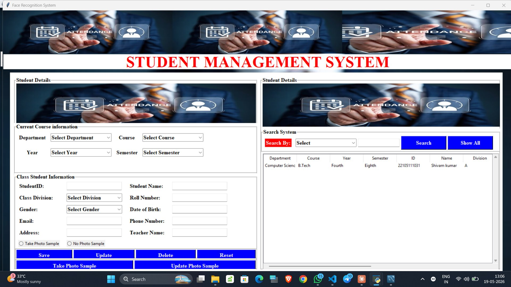
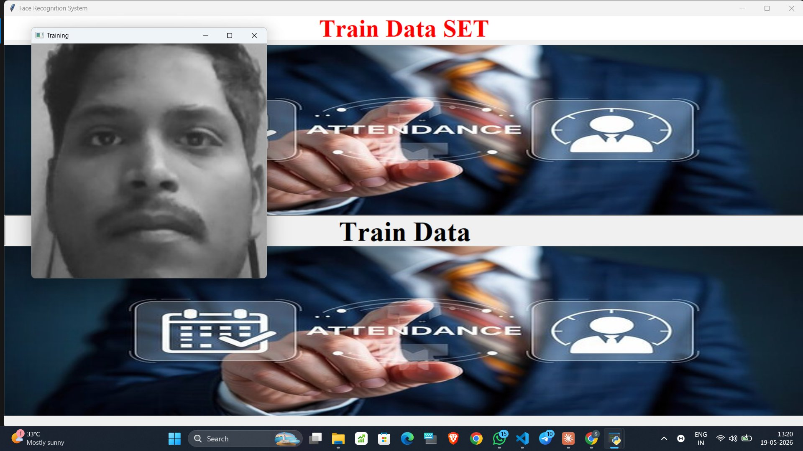
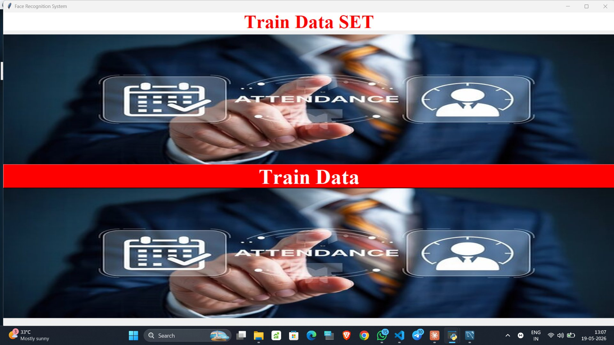
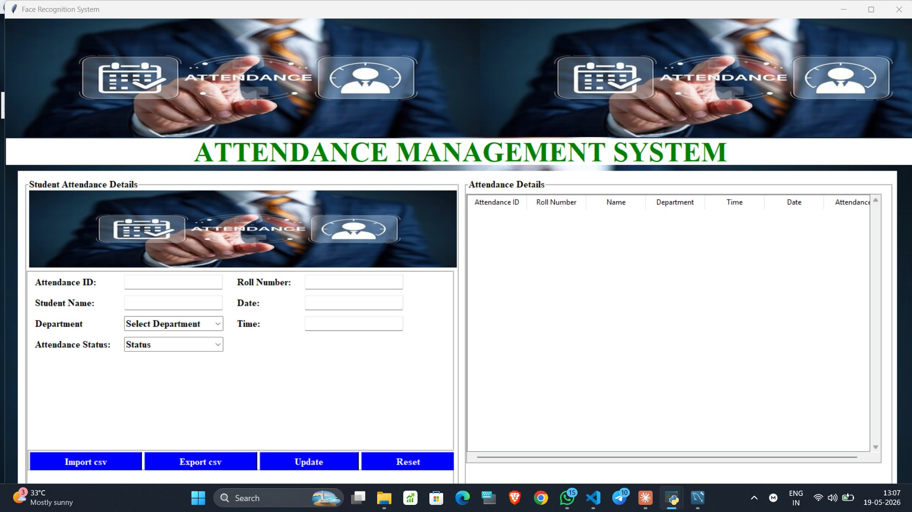
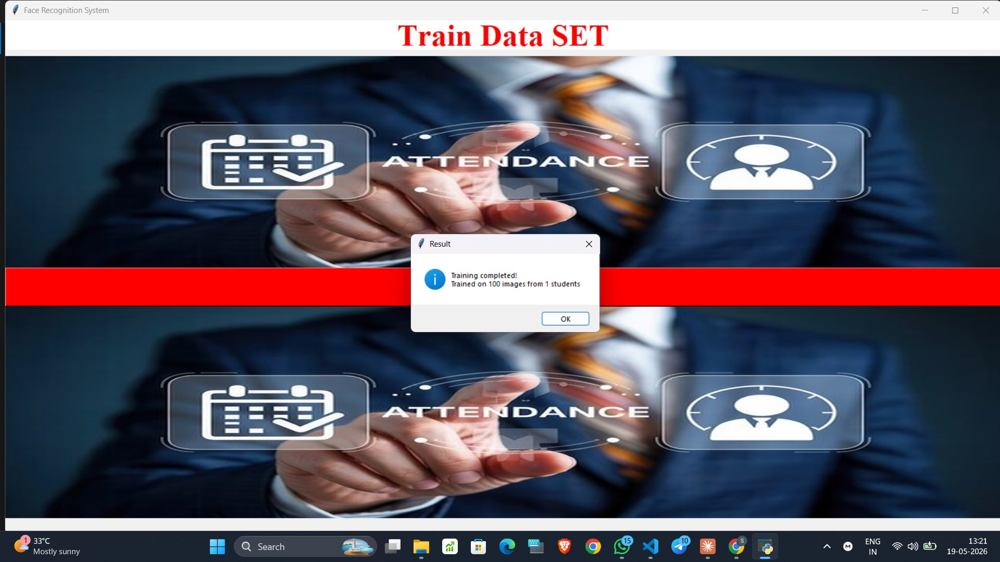
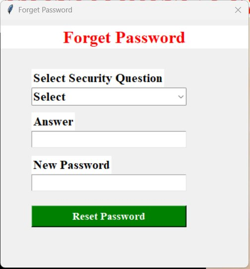
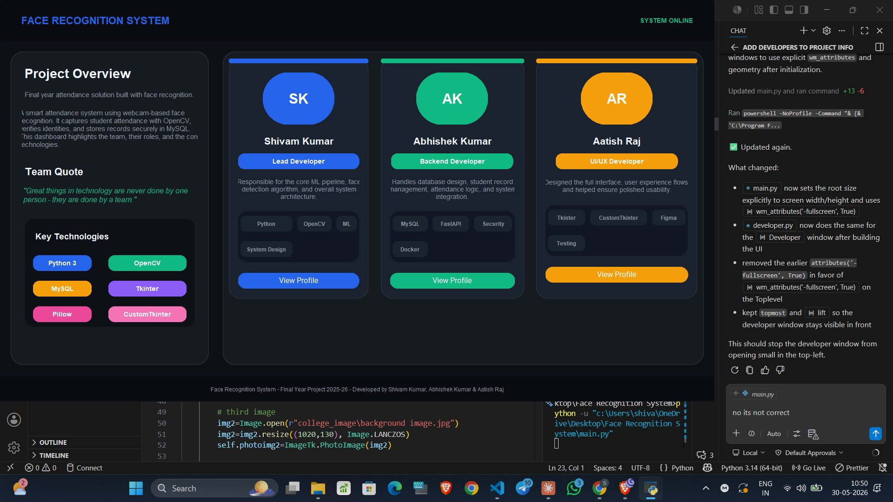

# 🎯 Smart Attendance Monitoring System Using Computer Vision

[](https://www.python.org/)
[](https://opencv.org/)
[](LICENSE)
[]()

> An intelligent, automated attendance system using real-time facial recognition and computer vision to streamline student identification and attendance tracking in educational institutions.

---

## 📋 Table of Contents

- [Overview](#overview)
- [Features](#features)
- [Technology Stack](#technology-stack)
- [Project Structure](#project-structure)
- [Installation](#installation)
- [Usage Guide](#usage-guide)
- [File Descriptions](#file-descriptions)
- [How It Works](#how-it-works)
- [Screenshots & Demo](#screenshots--demo)
- [System Requirements](#system-requirements)
- [Troubleshooting](#troubleshooting)
- [Future Enhancements](#future-enhancements)
- [Contributing](#contributing)
- [Authors](#authors)
- [License](#license)

---

## 🎯 Overview

The **Smart Attendance Monitoring System** is a comprehensive solution designed to automate and enhance the student attendance process in educational institutions. By leveraging cutting-edge computer vision and facial recognition technologies, this system eliminates the need for manual attendance marking, reduces human error, and provides real-time attendance tracking.

### Key Benefits:
- ⚡ **Fast & Accurate:** Real-time facial recognition with high accuracy
- 🔐 **Secure:** Database-backed attendance records with authentication
- 📊 **Automated:** Eliminates manual record-keeping
- 👥 **User-Friendly:** Intuitive GUI for administrators and students
- 💾 **Persistent:** MySQL database for reliable data storage

---

## ✨ Features

### 1. **Real-Time Face Recognition**
   - Detects and recognizes student faces using OpenCV and Haarcascade Classifier
   - Processes video stream in real-time
   - High accuracy facial matching with trained models

### 2. **Student Management System**
   - Add new students with registration details
   - Update student information (name, email, department, etc.)
   - Delete student records
   - View complete student database
   - Assign unique student IDs and enrollment details

### 3. **Face Training & Data Collection**
   - Capture facial images during registration
   - Automatic face training module to update classifier
   - Stores 40+ face samples per student for better accuracy
   - Incremental model improvement

### 4. **Automated Attendance Logging**
   - Real-time attendance marking when face is recognized
   - Automatic timestamp recording
   - Prevention of duplicate attendance for same student
   - Attendance reports with date and time

### 5. **Secure Authentication System**
   - User login with username/password validation
   - Separate access levels (Admin/Operator)
   - Registration with email verification
   - Session management

### 6. **Database Integration**
   - MySQL database for persistent storage
   - Student information management
   - Attendance records history
   - User credentials storage

### 7. **Professional GUI Interface**
   - Built with Tkinter for cross-platform compatibility
   - Responsive and intuitive design
   - Button-based navigation
   - Real-time camera feed display
   - Multiple module windows (Student, Face Recognition, Attendance)

### 8. **Reporting & Analytics**
   - View attendance records by date
   - Export attendance data to CSV
   - Student-wise attendance history
   - Department-wise statistics

---

## 🛠️ Technology Stack

| Component | Technology | Purpose |
|-----------|-----------|---------|
| **Frontend** | Tkinter | GUI Application Framework |
| **Computer Vision** | OpenCV | Image Processing & Face Detection |
| **Machine Learning** | scikit-learn, NumPy | Face Recognition & Classification |
| **Deep Learning** | TensorFlow | Enhanced facial recognition (optional) |
| **Database** | MySQL | Student & Attendance Data Storage |
| **Language** | Python 3.8+ | Core Programming Language |
| **Face Detection** | Haarcascade Classifier | Real-time face detection |

---

## 📁 Project Structure

```
Smart-Attendance-Monitoring-Using-Computer-Vision/
│
├── main.py                          # Main application entry point
├── login.py                         # User authentication module
├── register.py                      # User registration system
├── student.py                       # Student management module
├── face_recognition.py              # Face recognition & capture module
├── train.py                         # Face training & model building
├── attendence.py                    # Attendance recording & display
├── developer.py                     # Developer information module
├── help.py                          # Help & documentation module
│
├── haarcascade_frontalface_default.xml  # Pre-trained face detector
├── classifier.xml                   # Trained face classifier model
├── label_map.json                   # Student ID to name mapping
├── attendence.csv                   # Attendance records
│
├── college_image/                   # UI Background images
│   └── background image.jpg
│
├── data/                            # Student face dataset
│   ├── user.22105111031.1.jpg
│   ├── user.22105111031.2.jpg
│   ├── user.22105111021.1.jpg
│   └── ... (hundreds of face images)
│
├── screenshots/                     # Project screenshots used in README
│   ├── login.png
│   ├── register.png
│   ├── face_detected.png
│   ├── training_process.png
│   └── ... (UI screen captures)
└── README.md                        # Project documentation
```

---

## 🚀 Installation

### Prerequisites
- Python 3.8 or higher
- MySQL Server 5.7+
- Webcam/Camera device
- Windows/Linux/MacOS

### Step 1: Clone the Repository
```bash
git clone https://github.com/SHIVAM-DCE/Smart-Attendance-Monitoring-Using-Computer-Vision.git
cd Smart-Attendance-Monitoring-Using-Computer-Vision
```

### Step 2: Install Required Libraries
```bash
pip install -r requirements.txt
```

Or install manually:
```bash
pip install opencv-python
pip install pillow
pip install mysql-connector-python
pip install numpy
pip install scikit-learn
pip install tensorflow
```

### Step 3: Configure MySQL Database
1. Open MySQL Command Line or MySQL Workbench
2. Create database:
```sql
CREATE DATABASE attendance_system;
USE attendance_system;
```

3. Create tables:
```sql
-- Students table
CREATE TABLE students (
    StudentID INT PRIMARY KEY,
    StudentName VARCHAR(100),
    Department VARCHAR(50),
    Course VARCHAR(50),
    Year INT,
    Semester INT,
    Division VARCHAR(10),
    Roll_No VARCHAR(20),
    Gender VARCHAR(10),
    DOB DATE,
    Email VARCHAR(100),
    Phone VARCHAR(15),
    Address TEXT,
    Teacher VARCHAR(100)
);

-- Attendance table
CREATE TABLE attendance (
    AttendanceID INT AUTO_INCREMENT PRIMARY KEY,
    StudentID INT,
    Date DATE,
    Time TIME,
    Status VARCHAR(20),
    FOREIGN KEY (StudentID) REFERENCES students(StudentID)
);

-- Users table
CREATE TABLE users (
    UserID INT AUTO_INCREMENT PRIMARY KEY,
    Username VARCHAR(50) UNIQUE,
    Password VARCHAR(100),
    Email VARCHAR(100),
    Role VARCHAR(20)
);
```

### Step 4: Update Database Connection
Edit connection details in the code files:
```python
# In student.py, attendence.py, etc.
mydb = mysql.connector.connect(
    host="localhost",
    user="root",
    password="your_password",  # Change this
    database="attendance_system"
)
```

### Step 5: Run the Application
```bash
python main.py
```

---

## 📖 Usage Guide

### 1. **Login/Register**
   - Launch the application with `python main.py`
   - Create a new account using the **Register** button
   - Login with your credentials

### 2. **Student Registration**
   - Click **"Student Details"** button
   - Enter student information (Name, ID, Department, etc.)
   - Click **"Save"** to register the student

### 3. **Face Registration & Training**
   - Click **"Face Recognition"** button
   - Select a student from the list
   - Click **"Take Photos"** to capture 40+ face samples
   - Click **"Train Photos"** to train the classifier
   - Wait for training to complete

### 4. **Mark Attendance**
   - Click **"Face Recognition"** button
   - Allow camera access
   - Student's face will be detected and recognized automatically
   - Attendance will be marked automatically with timestamp

### 5. **View Attendance Records**
   - Click **"Attendance"** button
   - Select date range to filter records
   - View all marked attendance with student names
   - Export to CSV if needed

### 6. **Manage Students**
   - Update: Select student and modify information
   - Delete: Remove student from database
   - View: See all registered students with details

---

## 📄 File Descriptions

### Core Modules

| File | Purpose | Key Functions |
|------|---------|----------------|
| **main.py** | Application entry point & main GUI | `Face_Recognition_System` class, UI initialization |
| **login.py** | User authentication | User login, session validation |
| **register.py** | New user registration | Account creation, email validation |
| **student.py** | Student CRUD operations | Add/Update/Delete students, manage database |
| **face_recognition.py** | Real-time face detection & recognition | Capture frames, recognize faces, attendance marking |
| **train.py** | Train facial recognition model | Build classifier, update models |
| **attendence.py** | Attendance management | View records, export data, generate reports |
| **developer.py** | Developer information | Team details, contact info |
| **help.py** | Help & documentation | User guide, troubleshooting |

### Data Files

| File | Purpose |
|------|---------|
| **haarcascade_frontalface_default.xml** | Pre-trained cascade classifier for face detection |
| **classifier.xml** | Trained classifier for face recognition |
| **label_map.json** | Maps student IDs to names |
| **attendence.csv** | CSV file with all attendance records |

---

## 🧠 How It Works

### System Architecture Flow

```
┌─────────────────────────────────────────────────────────────┐
│                    APPLICATION START                        │
│                      (main.py)                              │
└─────────────────────────────────────────────────────────────┘
                            │
                            ▼
        ┌───────────────────────────────────────┐
        │       LOGIN / REGISTER SYSTEM          │
        │     (login.py / register.py)           │
        └───────────────────────────────────────┘
                            │
                ┌───────────┼───────────┐
                ▼           ▼           ▼
        ┌──────────────┐ ┌──────────────┐ ┌──────────────┐
        │   STUDENT    │ │ ATTENDANCE   │ │ FACE RECOG   │
        │  MANAGEMENT  │ │   TRACKING   │ │  & TRAINING  │
        │(student.py)  │ │(attendence.py)│ │(face_rec.py) │
        └──────────────┘ └──────────────┘ └──────────────┘
                │              │              │
                └──────────────┼──────────────┘
                               ▼
                    ┌──────────────────────┐
                    │  MYSQL DATABASE      │
                    │ - Students Table     │
                    │ - Attendance Table   │
                    │ - Users Table        │
                    └──────────────────────┘
```

### Recognition Algorithm

1. **Face Detection**: Uses Haarcascade Classifier to detect face regions in each frame
2. **Face Extraction**: Extracts detected face ROI (Region of Interest)
3. **Feature Extraction**: Computes facial features for comparison
4. **Face Matching**: Compares with trained classifier to find matching student
5. **Confidence Scoring**: Returns confidence level of match
6. **Attendance Update**: Records attendance if confidence > threshold

---

## 📸 Screenshots & Demo

The `screenshots/` folder contains the UI image captures used throughout this documentation. Add or update the PNG files in `screenshots/` whenever the interface changes, and reference them here so the README stays in sync with the application.

### Available screenshots
- `login.png`
- `register.png`
- `forgot_password.png`
- `admin_access.png`
- `admin_access2.png`
- `main_dashboard.png`
- `student_management.png`
- `face_detected.png`
- `face_recognition_module.png`
- `train_data_set.png`
- `training_process.png`
- `training_complete.png`
- `attendance_management.png`
- `help_desk.png`
- `developer_dashboard.png`

### 🔐 Login Screen
> Secure login portal with username/password authentication and account creation options.


---

### 📝 Register Screen
> New user registration form with security question setup for password recovery.


---

### 🔑 Forgot Password
> Password recovery using pre-set security questions.


---

### 🔒 Admin Access Control
> Role-based access — certain features are restricted to admin users only.




---

### 🏠 Main Dashboard
> Central navigation hub with quick-access buttons to all system modules — Student Details, Detect Face, Attendance, Train Face, Photo Face, Developer, Help, and Exit.


---

### 👨‍🎓 Student Management System
> Full CRUD interface to register, update, delete, and search students with department, course, year, and semester filters.


---

### 🎥 Face Recognition Module
> Real-time camera feed with Haarcascade face detection. Recognized student details (ID, Roll No., Name, Department) are displayed live on screen with a green bounding box.





---

### 🧠 Train Data SET
> Training interface where captured face images are processed to build/update the facial classifier model.




---

### 📊 Attendance Management System
> View, filter, update, import/export attendance records. Supports CSV import and export for offline access.



---

### 🛠️ Help Desk
> Contact and support information for users.



---

### 👨‍💻 Developer Dashboard
> Team overview highlighting the three developers, their roles, key technologies used, and project description.



---

## 💻 System Requirements

### Minimum Requirements:
- **OS**: Windows 7+, Linux, or macOS
- **RAM**: 2GB minimum (4GB recommended)
- **Storage**: 500MB for application and data
- **Processor**: Intel i3 or equivalent
- **Camera**: USB Webcam (720p minimum)

### Recommended:
- **RAM**: 8GB or higher
- **Processor**: Intel i5/i7 or equivalent
- **Camera**: HD Webcam (1080p)
- **MySQL**: Version 5.7 or 8.0

---

## 🔧 Troubleshooting

### Issue: Camera not working
**Solution:**
- Check USB connection
- Install camera drivers
- Give camera permissions in application settings
- Test camera with other applications first

### Issue: Database connection error
**Solution:**
- Verify MySQL server is running
- Check database credentials in code
- Ensure database and tables are created
- Check network connectivity

### Issue: Face not recognized
**Solution:**
- Ensure good lighting conditions
- Capture more face samples (40+)
- Retrain the classifier
- Check face is clearly visible
- Remove glasses/hats for better recognition

### Issue: Low recognition accuracy
**Solution:**
- Capture training data in various lighting
- Include different angles and distances
- Use 50+ samples per student
- Keep face centered in frame
- Retrain after adding more samples

### Issue: Slow performance
**Solution:**
- Close other applications
- Reduce video resolution
- Check system RAM usage
- Optimize database queries
- Update graphics drivers

---

## 🚀 Future Enhancements

- [ ] **Multi-factor Authentication**: Add OTP/SMS verification
- [ ] **Deep Learning Models**: Integrate TensorFlow/PyTorch for better accuracy
- [ ] **Mobile App**: Android/iOS attendance tracking
- [ ] **Cloud Storage**: AWS/Azure integration for data backup
- [ ] **Advanced Analytics**: Generate detailed reports and statistics
- [ ] **Liveness Detection**: Prevent spoofing with photo/video
- [ ] **Email Notifications**: Automated attendance reports to email
- [ ] **Biometric Integration**: Support for fingerprint and iris scanning
- [ ] **REST API**: Build backend API for integrations
- [ ] **Real-time Dashboard**: Web-based monitoring interface

---

## 🤝 Contributing

Contributions are welcome! To contribute:

1. Fork the repository
2. Create a feature branch (`git checkout -b feature/YourFeature`)
3. Commit changes (`git commit -m 'Add YourFeature'`)
4. Push to branch (`git push origin feature/YourFeature`)
5. Open a Pull Request

Please ensure your code follows PEP 8 standards and includes documentation.

---

## 👨‍💻 Authors

This project was collaboratively developed by a team of three as a Final Year Project (2025–26):

| Name | Role | Responsibilities |
|------|------|-----------------|
| **Shivam Kumar** | Lead Developer | Core ML pipeline, face detection algorithm, overall system architecture |
| **Abhishek Kumar** | Backend Developer | Database design, student record management, attendance logic, system integration |
| **Aatish Raj** | UI/UX Developer | Full interface design, user experience flows, usability testing |

> *"Great things in technology are never done by one person — they are done by a team."*

### Contact
- 📧 **Shivam Kumar** — [shivamkumarkaimur@gmail.com](mailto:shivamkumarkaimur@gmail.com)
- 🔗 GitHub: [@SHIVAM-DCE](https://github.com/SHIVAM-DCE)
- 🎓 Darbhanga College of Engineering

---

## 📜 License

This project is licensed under the MIT License — see the [LICENSE](LICENSE) file for details.

---

## 🙏 Acknowledgments

- OpenCV community for computer vision libraries
- Haarcascade Cascade Classifiers
- MySQL documentation
- Python and Tkinter documentation
- All contributors and testers

---

## 📞 Support

For issues, questions, or suggestions:
- Open an issue on GitHub
- Contact: shivamkumarkaimur@gmail.com
- Check documentation in `help.py`

---

**Last Updated:** June 2026  
**Version:** 1.0.0  
**Status:** ✅ Production Ready

---

*If you found this project helpful, please consider giving it a ⭐ star on GitHub!*

